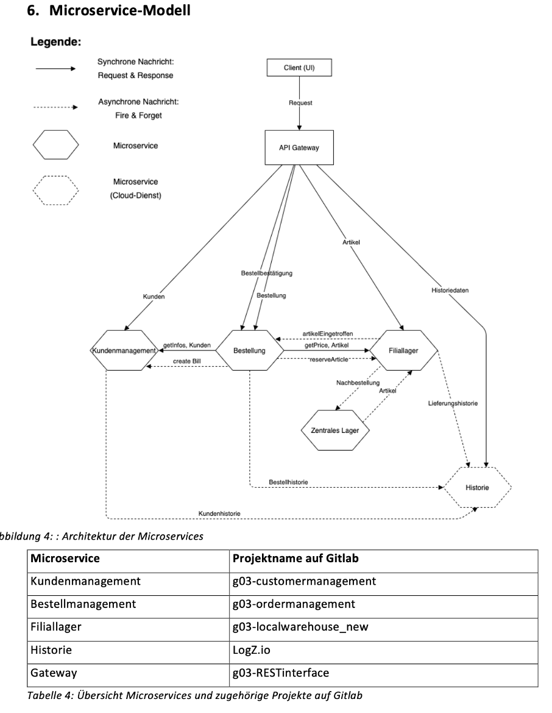

# Modul-APPE
Projectwork of the modul "Applikationsentwicklung" organized by University of Applied Science Luzern where we build an Application following a Microservice architecture. We used RabbitMQ as a Messaging-System for the internal communication and all services (without the orderservice) are using Micronaut as a Microservice chassis.

